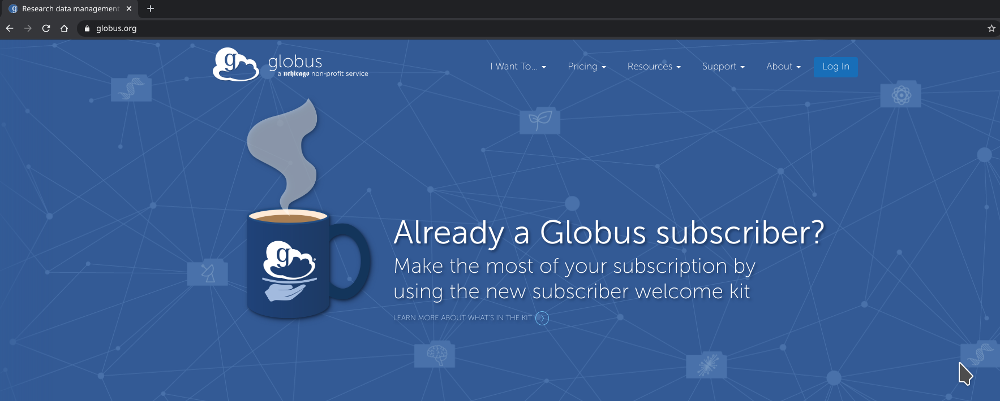
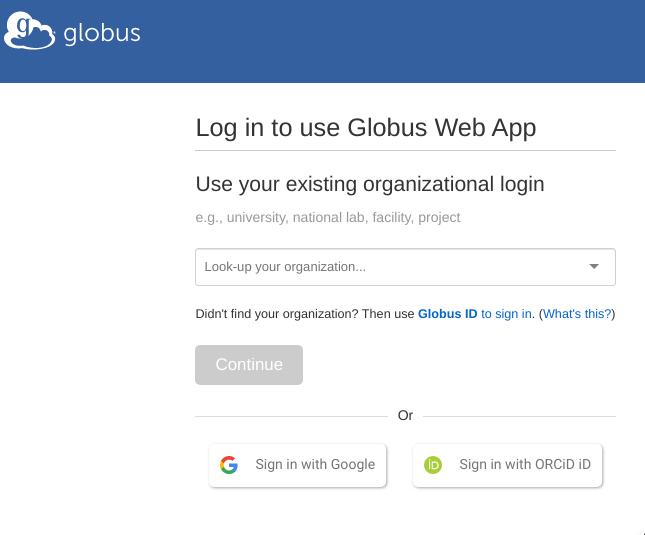
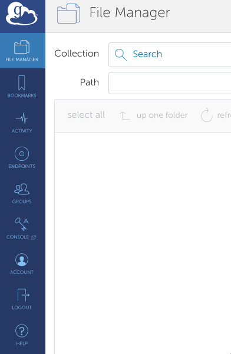
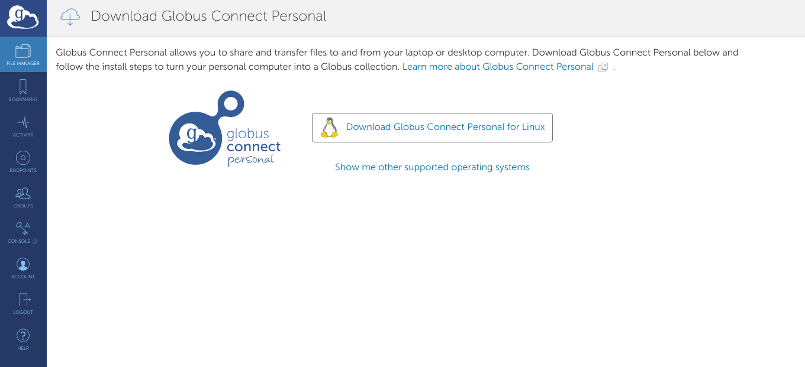

# Globus

To get Globus set up on your machine and access to the SuperDARN mirror:
1. go to globus.org (login button in top right -> then on the next page "use
Globus ID to sign up" near middle to bottom of page)
    
    

1. On the next page you have several options to log into Globus, choose one of them:
    1. A link saying "Need a Globus ID? Sign Up" to create a new Globus ID
    1. A link to log in using your Google account
    1. A link to log in using your Orcid account
    1. A drop-down menu to log in using your institutional account

    

1. Log in to Globus via login button on globus.org
1. Click on "Endpoints" tab on left side of screen

    

1. Click on "Create a Personal Endpoint" in the top right
1. Now download Globus Connect Personal for your operating system
    1. Either click the link on the page you're brought to or:
    1. If on Linux: `wget https://downloads.globus.org/globus-connect-personal/linux/stable/globusconnectpersonal-latest.tgz`

    

1. Now do the following to run globusconnectpersonal:
    1. `tar xvf globusconnectpersonal-latest.tgz`
    1. `cd globusconnectpersonal*`
    1. `./globusconnectpersonal` 
    1. Follow the instructions in the GUI that opens up 
1. Contact us with your Globus username to share the SuperDARN endpoint with you

Now to get these scripts working you need to do the following:

1. Use python 3, so Download the latest version from here: https://www.python.org/downloads/
1. Install pip if you don't have it 
    1. On OpenSuSe: `sudo zypper in python3-pip`
    1. On Windows: It should already be installed with the python3 binary package installation
1. Install the Globus sdk for python
    1. OpenSuSe: `sudo pip3 install globus-sdk`
    1. Windows: `py -m pip install globus-sdk`
1. Now make sure the script is runnable
    1. OpenSuSe: `chmod +x sync_radar_data_globus.py`
    1. Windows: From the cmd.exe launcher, python scripts should already be executable
1. Now run the script with some arguments, such as:
    1. Linux: `/sync_radar_data_globus.py -y 2007 -m 01 -p 20070101*sas /path/to/endpoint/dir`
    1. Windows: `py sync_radar_data_globus.py -y 2019 -m 03 -p 20190304*rkn /C/Users/Kevin/Documents/`

*** NOTE *** On Windows, by default, the only directory you can write to is your home `Documents`
directory, such as `/C/Users/Kevin/Documents/`. To change this, or add new directories, you must
do so in the configuration of globusconnectpersonal.

Running the script for the first time, it will ask you to log into Globus to authenticate, 
give you a token to paste into the cmd line, then it will save a refresh token to a file on your 
computer to use for automatic login from now on.

** Note ** If you have an old transfer token file (`~/.globus_tranfser_rt`) and you try to run this
script, it may come up with an authentication error. In this instance you should remove the old
file and re-run the script. This will go through the process of manual authentication again, and
create a new transfer token file for automatic use.

